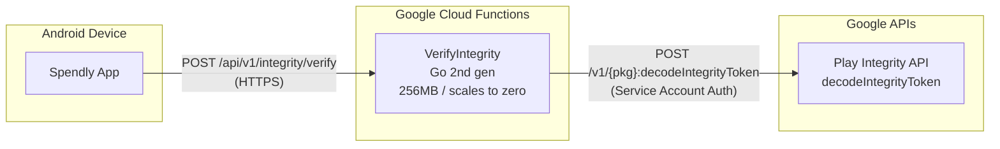

# Play Integrity Backend Service

## Status: Planned

---

## 1. Purpose

A lightweight HTTP service that receives Play Integrity tokens from the Spendly Android app,
decrypts them using Google's Play Integrity API, and returns structured verdict results to the
client. This enables the **classic (backend-verified) path** of the hybrid integrity check.

---

## 2. API Contract

### 2.1 Endpoint

```
POST /api/v1/integrity/verify
```

### 2.2 Authentication

No client authentication. The Google-signed integrity token itself is the proof of authenticity.
The backend decrypts it with Google's service account key and validates the claims.

### 2.3 Request

```
Content-Type: application/json
```

```json
{
    "token": "<encrypted_integrity_token_from_client>",
    "packageName": "dev.lanthoor.spendly"
}
```

| Field | Type | Description |
|-------|------|-------------|
| `token` | `string` | Base64-encoded integrity token from `IntegrityManager.requestIntegrityToken()` |
| `packageName` | `string` | Android app package name (always `dev.lanthoor.spendly`) |

### 2.4 Response (Success - 200 OK)

```json
{
    "deviceRecognitionVerdict": ["MEETS_DEVICE_INTEGRITY", "MEETS_BASIC_INTEGRITY"],
    "accountDetails": {
        "appLicensingVerdict": "LICENSED"
    },
    "appRecognitionVerdict": "PLAY_RECOGNIZED"
}
```

| Field | Type | Description |
|-------|------|-------------|
| `deviceRecognitionVerdict` | `string[]` | List of verdict labels. Possible values: `MEETS_DEVICE_INTEGRITY`, `MEETS_BASIC_INTEGRITY`. Empty or absent means neither. |
| `accountDetails.appLicensingVerdict` | `string?` | `LICENSED`, `UNLICENSED`, `UNEVALUATED` |
| `appRecognitionVerdict` | `string?` | `PLAY_RECOGNIZED`, `UNRECOGNIZED_VERSION`, `UNEVALUATED` |

### 2.5 Response (Error)

Returns standard HTTP error codes:

| Status | Meaning |
|--------|---------|
| `400` | Invalid request (missing token, bad package name) |
| `401` | Token decryption failed / invalid token |
| `403` | Package name mismatch |
| `500` | Internal server error / Google API call failed |
| `503` | Google Play Integrity API unavailable |

Error body:
```json
{
    "error": "string description"
}
```

---

## 3. Workflow

### 3.1 Sequence Diagram

```mermaid
sequenceDiagram
    participant Client as Spendly Android App
    participant Backend as Backend Service
    participant Google as Google Play Integrity API

    Client->>Backend: POST /api/v1/integrity/verify<br/>{ token, packageName }
    activate Backend

    Backend->>Backend: 1. Validate request body

    Backend->>Google: POST /v1/{pkg}:decodeIntegrityToken<br/>{ integrityToken }<br/>Authorization: Bearer &lt;sa-token&gt;
    activate Google
    Google-->>Backend: { tokenPayloadExternal: {<br/>  requestDetails, appIntegrity,<br/>  deviceIntegrity, accountDetails<br/>} }
    deactivate Google

    Backend->>Backend: 2. Extract relevant verdicts
    Backend->>Backend: 3. Build simplified response

    Backend-->>Client: 200 OK<br/>{ deviceRecognitionVerdict,<br/>  appRecognitionVerdict, accountDetails }
    deactivate Backend

    Client->>Client: Map to IntegrityVerdict<br/>MEETS_DEVICE_INTEGRITY → Green<br/>MEETS_BASIC_INTEGRITY → Yellow<br/>PLAY_RECOGNIZED absent → Red
```

---

## 4. Google Play Integrity Decode API

### 4.1 Endpoint

```
POST https://playintegrity.googleapis.com/v1/{packageName}:decodeIntegrityToken
```

Reference: [Google Play Integrity API - Decode integrity token](https://developers.google.com/android/play/reference/playintegrity/rest/v1/v1/decodeIntegrityToken)

### 4.2 Authentication

Uses a Google Cloud service account with the **Play Integrity API Viewer** role.
Obtain an OAuth 2.0 access token via service account key (JWT bearer assertion).

### 4.3 Request

```json
{
    "integrityToken": "<base64_token_from_client>"
}
```

### 4.4 Response (Relevant Fields)

```json
{
    "tokenPayloadExternal": {
        "requestDetails": {
            "requestPackageName": "dev.lanthoor.spendly",
            "nonce": "<nonce_if_sent>",
            "timestampMillis": 1716400000000
        },
        "appIntegrity": {
            "appRecognitionVerdict": "PLAY_RECOGNIZED",
            "certificateSha256Digest": ["..."],
            "packageName": "dev.lanthoor.spendly",
            "versionCode": 98
        },
        "deviceIntegrity": {
            "deviceRecognitionVerdict": [
                "MEETS_DEVICE_INTEGRITY",
                "MEETS_BASIC_INTEGRITY"
            ]
        },
        "accountDetails": {
            "appLicensingVerdict": "LICENSED"
        }
    }
}
```

### 4.5 Decryption Key

The integrity token is encrypted. Google decrypts it server-side using the decryption key
associated with your Play Console app. The decryption key is obtained from:

- **Play Console → App Integrity → Integrity API → Response encryption**

Copy the **"Decryption key"** (base64). This must be passed to the decode API as part
of the service account auth context, or you configure it per-project via the API client
library (the library handles this automatically when using the correct service account).

---

## 5. Reference Implementation (Go + Cloud Functions)

### 5.1 Why Go + Cloud Functions

A Cloud Function scales to zero when not invoked — you only pay for actual requests.
For an offline-first app like Spendly, the integrity check fires once per app cold start,
so a long-running server would be wasteful. Go is the ideal runtime: fast cold starts
(typically 100–300ms), minimal memory footprint, and the official `google.golang.org/api`
client library gives idiomatic access to the Play Integrity decode API.

### 5.2 Project Structure

```
spendly-integrity-function/
├── go.mod
├── go.sum
├── function.go
└── cmd/
    └── main.go          # optional local dev server
```

### 5.3 `go.mod`

```
module github.com/lanthoor/spendly-integrity

go 1.23

require (
    cloud.google.com/go/auth v0.14.0
    google.golang.org/api v0.216.0
)
```

### 5.4 `function.go` — Cloud Function Entry Point

```go
package integrity

import (
    "context"
    "encoding/json"
    "log"
    "net/http"
    "strings"
    "time"

    "cloud.google.com/go/auth/credentials"
    playintegrity "google.golang.org/api/playintegrity/v1"
)

const (
    packageName   = "dev.lanthoor.spendly"
    apiBaseURL    = "https://playintegrity.googleapis.com"
    playIntegrityScope = "https://www.googleapis.com/auth/playintegrity"
    requestTimeout     = 8 * time.Second
)

// VerifyIntegrity is the Cloud Function entry point.
// Trigger: HTTP POST with JSON body { token, packageName }.
func VerifyIntegrity(w http.ResponseWriter, r *http.Request) {
    ctx, cancel := context.WithTimeout(r.Context(), requestTimeout)
    defer cancel()

    var req integrityRequest
    if err := json.NewDecoder(r.Body).Decode(&req); err != nil {
        writeError(w, http.StatusBadRequest, "invalid JSON body")
        return
    }

    if strings.TrimSpace(req.Token) == "" {
        writeError(w, http.StatusBadRequest, "missing token")
        return
    }
    if req.PackageName != packageName {
        writeError(w, http.StatusForbidden, "invalid package name")
        return
    }

    log.Printf("Decoding integrity token for package=%s", req.PackageName)

    payload, err := decodeIntegrityToken(ctx, req.Token)
    if err != nil {
        log.Printf("Google API error: %v", err)
        writeError(w, http.StatusBadGateway, "Google Play Integrity API error")
        return
    }

    writeJSON(w, http.StatusOK, integrityResponse{
        DeviceRecognitionVerdict: verdictStringSlice(payload.DeviceIntegrity),
        AccountDetails:          accountDetails(payload.AccountDetails),
        AppRecognitionVerdict:   appVerdictString(payload.AppIntegrity),
    })
}

func decodeIntegrityToken(ctx context.Context, token string) (*playintegrity.TokenPayloadExternal, error) {
    creds, err := credentials.DetectDefault(&credentials.DetectOptions{
        Scopes: []string{playIntegrityScope},
    })
    if err != nil {
        return nil, err
    }

    svc, err := playintegrity.NewService(ctx, playintegrity.WithBaseURL(apiBaseURL), playintegrity.WithCredentials(creds))
    if err != nil {
        return nil, err
    }

    decodeReq := &playintegrity.DecodeIntegrityTokenRequest{IntegrityToken: token}
    decoded, err := svc.V1.DecodeIntegrityToken(packageName, decodeReq).Context(ctx).Do()
    if err != nil {
        return nil, err
    }
    return decoded.TokenPayloadExternal, nil
}

func verdictStringSlice(di *playintegrity.DeviceIntegrity) []string {
    if di == nil || di.DeviceRecognitionVerdict == nil {
        return nil
    }
    // Deduplicate and return
    seen := map[string]bool{}
    var out []string
    for _, v := range di.DeviceRecognitionVerdict {
        if !seen[v] {
            seen[v] = true
            out = append(out, v)
        }
    }
    return out
}

func appVerdictString(ai *playintegrity.AppIntegrity) *string {
    if ai == nil {
        return nil
    }
    return &ai.AppRecognitionVerdict
}

func accountDetails(ad *playintegrity.AccountDetails) *accountDetailsResponse {
    if ad == nil {
        return nil
    }
    return &accountDetailsResponse{AppLicensingVerdict: ad.AppLicensingVerdict}
}

// ---- request / response types ----

type integrityRequest struct {
    Token       string `json:"token"`
    PackageName string `json:"packageName"`
}

type integrityResponse struct {
    DeviceRecognitionVerdict []string               `json:"deviceRecognitionVerdict"`
    AccountDetails           *accountDetailsResponse `json:"accountDetails,omitempty"`
    AppRecognitionVerdict    *string                 `json:"appRecognitionVerdict,omitempty"`
}

type accountDetailsResponse struct {
    AppLicensingVerdict string `json:"appLicensingVerdict"`
}

// ---- helpers ----

func writeJSON(w http.ResponseWriter, status int, v any) {
    w.Header().Set("Content-Type", "application/json")
    w.WriteHeader(status)
    json.NewEncoder(w).Encode(v)
}

func writeError(w http.ResponseWriter, status int, msg string) {
    writeJSON(w, status, map[string]string{"error": msg})
}
```

### 5.5 `cmd/main.go` — Local Dev Server (Optional)

```go
package main

import (
    "log"
    "net/http"
    "os"

    "github.com/lanthoor/spendly-integrity"
)

func main() {
    port := os.Getenv("PORT")
    if port == "" {
        port = "8080"
    }

    http.HandleFunc("/api/v1/integrity/verify", integrity.VerifyIntegrity)

    log.Printf("Listening on :%s", port)
    log.Fatal(http.ListenAndServe(":"+port, nil))
}
```

Run locally: `PORT=8080 go run ./cmd/main.go`

### 5.6 Why This is Cheaper

| Model | Approx. monthly cost (1k req/month) |
|-------|-------------------------------------|
| Cloud Run (always-on 256MB) | ~$10–15 |
| Cloud Functions 2nd gen (pay-per-call) | ~$0 |

Cloud Functions 2nd gen pricing: first 2 million invocations/month are **free**.
After that, $0.40/million invocations. A single Spendly user checks integrity once
per app cold start — you'd need millions of users to exceed the free tier.

---

## 6. Deployment

### 6.1 Deployment Topology



### 6.2 Cloud Functions 2nd Gen Deployment

```bash
gcloud functions deploy VerifyIntegrity \
    --gen2 \
    --runtime=go123 \
    --region=us-central1 \
    --source=. \
    --entry-point=VerifyIntegrity \
    --trigger-http \
    --allow-unauthenticated \
    --memory=256Mi \
    --timeout=10s \
    --min-instances=0 \
    --max-instances=1 \
    --service-account=spendly-integrity@YOUR_PROJECT.iam.gserviceaccount.com
```

| Flag | Purpose |
|------|---------|
| `--gen2` | Uses Cloud Functions 2nd gen (Cloud Run-based, faster cold start) |
| `--runtime=go123` | Go 1.23 runtime |
| `--trigger-http` | Exposes function via HTTP endpoint |
| `--min-instances=0` | Scales to zero (no cost when idle) |
| `--max-instances=1` | Single instance (low-traffic single endpoint) |
| `--allow-unauthenticated` | No IAM auth — the token itself authenticates the request |
| `--timeout=10s` | 10 second timeout (Google API takes 2-5s typically) |

### 6.3 Environment Variables

| Variable | Description |
|----------|-------------|
| `GOOGLE_APPLICATION_CREDENTIALS` | Auto-injected by Cloud Functions when using `--service-account` |

No manual env vars required — the function uses ADC (Application Default Credentials)
provided by the attached service account.

### 6.4 Domain / URL

After deployment, the function will have a URL like:

```
https://us-central1-YOUR_PROJECT.cloudfunctions.net/VerifyIntegrity
```

Configure `INTEGRITY_BACKEND_URL` in `app/build.gradle.kts` to this URL.

### 6.5 Cost Estimate

| Usage | Cost |
|-------|------|
| 0 – 2M invocations/month | **Free** |
| 2M+ invocations/month | $0.40 per million |
| Compute (256MB, ~400ms avg execution) | Negligible (within free tier) |

For Spendly's traffic pattern (one call per app cold start), the function will
stay well within the free tier indefinitely.

---

## 7. Security Considerations

| Concern | Mitigation |
|---------|------------|
| Token replay | Send a nonce from client; backend validates it hasn't been used before |
| Token reuse across devices | Token contains `requestDetails.requestPackageName` — verify matches |
| Service account key compromise | Rotate keys; restrict access with minimal IAM roles |
| DoS / abuse | Add rate limiting (e.g., 10 req/min per IP) since legitimate traffic is very low |
| MITM | Always use HTTPS (Cloud Run provides TLS termination) |
| Client sends arbitrary token | The decode API will reject invalid/expired tokens |

### 7.1 Nonce Validation (Recommended Enhancement)

The client generates a random nonce and sends it in the Play Integrity request.
The backend stores the nonce temporarily (Redis/DB with TTL) and validates it
matches the decrypted token. This prevents token replay attacks.

```go
// Client generates:
nonce := make([]byte, 32)
rand.Read(nonce)
nonceStr := base64.RawURLEncoding.EncodeToString(nonce)

// Backend validates:
if payload.RequestDetails != nil && payload.RequestDetails.Nonce != nonceStr {
    writeError(w, http.StatusBadRequest, "nonce mismatch")
    return
}
```

---

## 8. Monitoring

| Metric | How |
|--------|-----|
| Request volume | Cloud Functions invocation count |
| Error rate | Cloud Functions error count + error budget |
| Latency | Cloud Functions execution time metrics |
| Google API errors | Structured logging (Cloud Logging) with error details |
| Suspicious activity | Rate of 400/403 responses |
